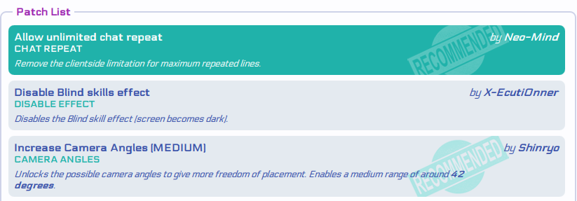
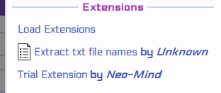
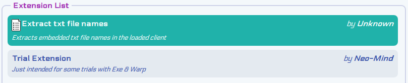
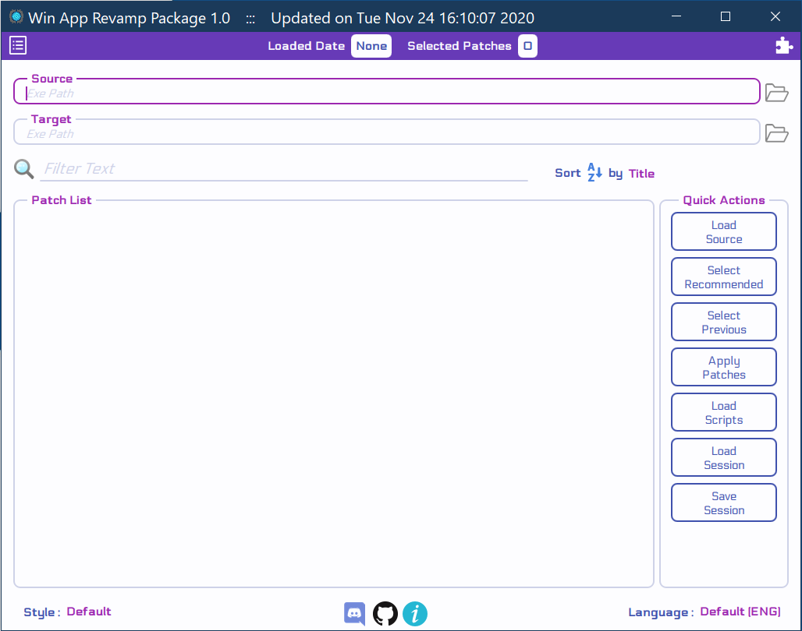
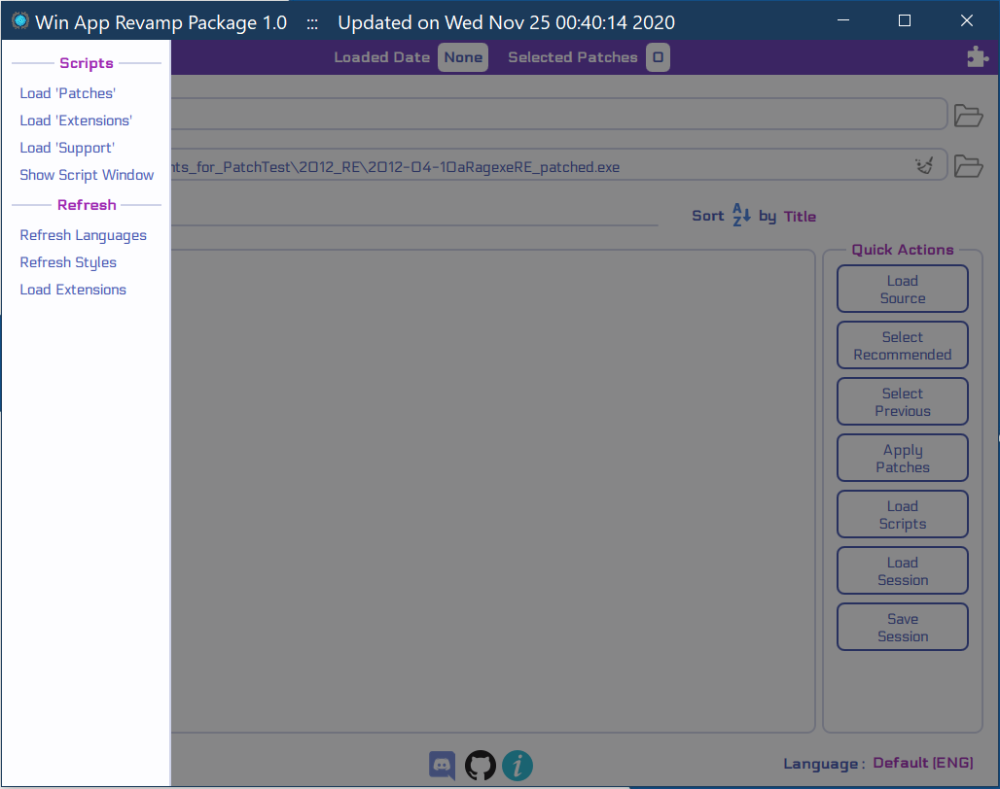
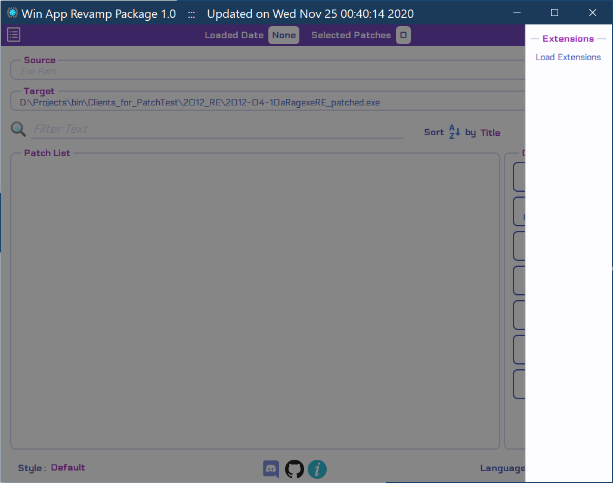
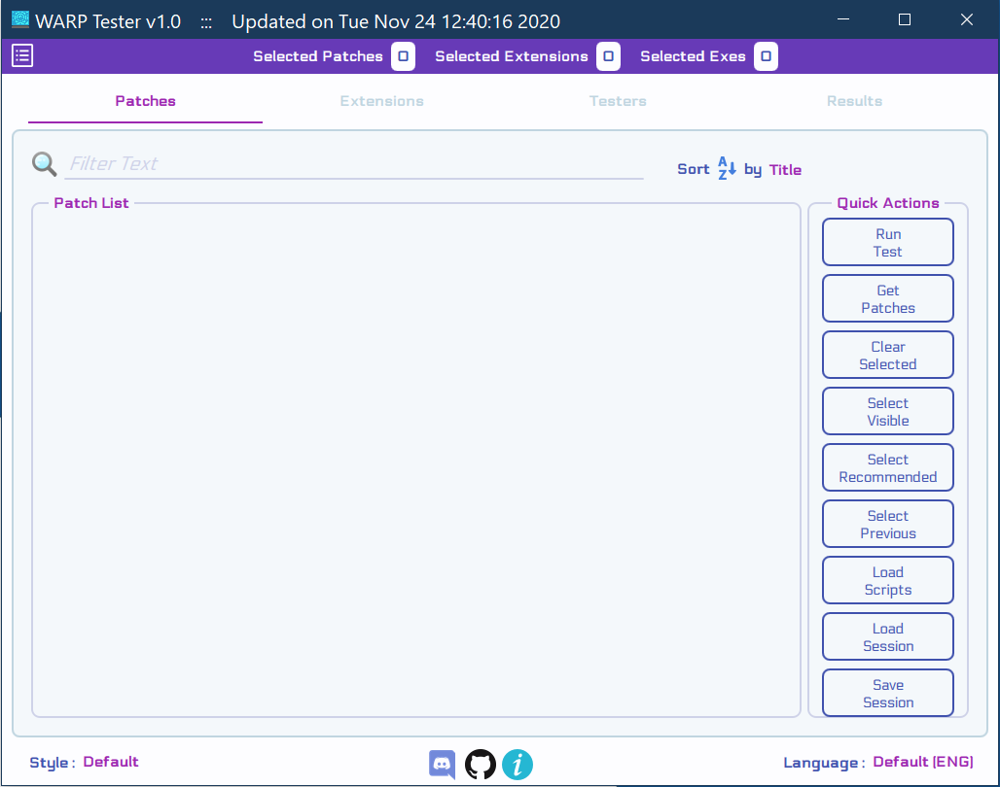
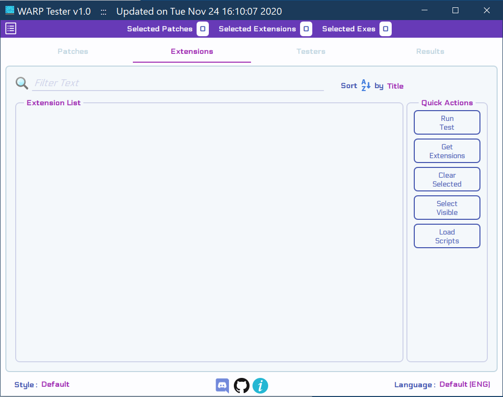
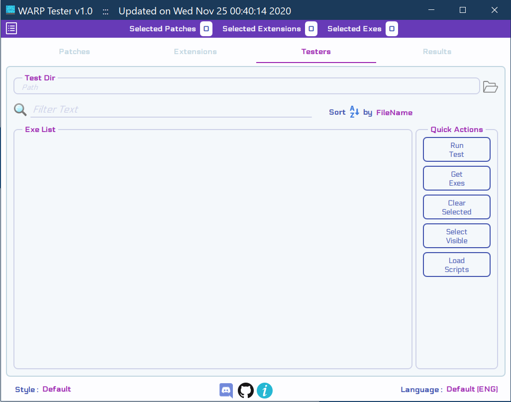
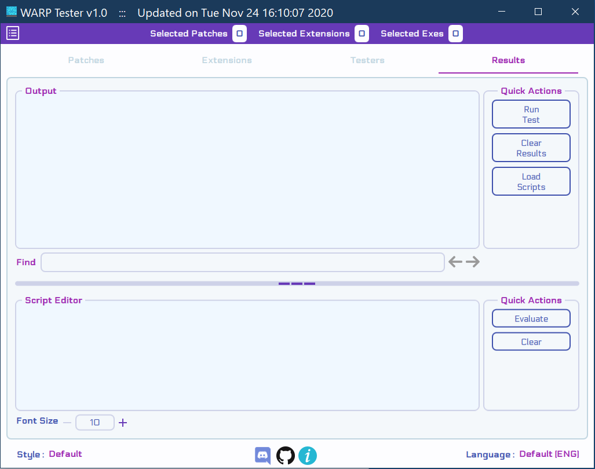

# Usage Guide
This Guide helps you familiarize yourself with the 3 tools being provided in this package.

## Table of Contents

- [Overview](#overview)
	- [Quick Start](#quick-start)
	- [Patches](#patches)
	- [Extensions](#extensions)
- [Main GUI]
- [Console]
- [Script Window]
- [Tester GUI]
- [Shortcuts](#shortcuts)
- [Other Links](#other-links)

## Overview

### Quick Start

1. Clone the Repository
   ```text
   git clone https://github.com/Neo-Mind/WARP.git --branch <branch name> --single--branch
   ```
   For e.g. you can use **'rock-win32'** branch for use in Windows Environment and having stuff for RO client.

2. Goto the OS specific directory inside the cloned repo `For e.g. 'win32'`

3. Launch the tool you want and you are ready.

### Patches

In the context of WARP, a Patch refers to an entity which sets up changes to be performed on the loaded app when the patch is 'applied'.<br>
Since the changes would not be same for every app, this process is automated by means of an associated function implemented in QJS scripts.<br>
Patches are represented by means of its title, author name, recommendation status & description as shown in the snap below.<br>
The green one is selected. Refer [Patch & Extension Guide] for further details.



### Extensions

Extensions are additional features to the tool implemented by means of QJS functions. Most often their purpose is to extract some part of the loaded app.<br>
They are only used in GUI mode (as of now) i.e. [Console] do not support extensions. For [Main GUI] they get added to the right drawer (moving side panel) as shown below.



For [Tester GUI] they are added into a list as shown below.<br>
The green one is selected for testing. Refer [Patch & Extension Guide] for further details.



### Sessions

Session refers to set of patch selections & user inputs. They are saved as YAML files.<br>
Optionally it could also include Source & Target apps. Refer [Settings & Session Files] for further details.

## Main GUI

### General Workflow

- Load the **Source** app.
- Select the patches you want.
- Some of the patches ask for specific inputs from you so provide them as well.
- Once you are ready click **Apply Patches** to create the **Target**.

### Interface details

For Windows, the Main GUI is available as WARP.exe in win32 folder. Once you launch it, you get an interface as shown below.



It contains the following Parts:

- Header

	- **Loaded Date**<br>
	Shows the build date for the current loaded application.
	
	- **Selected Patches**<br>
      Shows the count of currently selected patches.

- Input/Output

	- **Source**<br>
	  Enter the application which needs to be loaded & queried. You can use the folder button to browse and select an existing file.
	  
	- **Target**<br>
	  Enter the file name to use for revamped source. WARP tries to use the source name suffixed with **_patched** by default. You can use the same path as the source if you want, **but at your own risk**. You can use the folder button to browse and select a new file name.

- Filter/Sort

	- **Filter**<br>
	  You can put a Regular expression here for filtering the list of patches below to a smaller set. The expression is Case Insensitive.
	  
	- **Sort**<br>
	  You can sort the list of patches in ascending/descending order by the specified category.

- Patch List<br>

Once the application is loaded, this list gets populated with all defined patches that are valid for the loaded app.<br>
Patches are defined in **'Patches.yml'** file . See [Patch & Extension Guide] for more details.

- Quick Actions

	- **Load Source**<br>
	  Loads the application specified as Source & populates the Patch List. Also loads the scripts if not done already.
	  
	- **Select Recommended**<br>
	  Select Patches marked as **'Recommended'**.
	  
	- **Select Previous**<br>
	  Select Patches used in a previous session (available in **'LastSession.yml'**).
	  
	- **Apply Patches**<br>
	  Apply all selected patches on the loaded app and save the output to 'Target' path.
	  
	- **Load Scripts**<br>
	  Load all QJS scripts provided under **'Scripts'** folder hierarchy (except for **'Init'**).
	  
	- **Load Session**<br>
	  Load a previously saved session YAML file. See [Settings & Session Files] for more details.
	  
	- **Save Session**<br>
	  Save the current session to a YAML file. See [Settings & Session Files] for more details.

- Footer

	- **Style**<br>
	  Set the style i.e. Colors & Fonts (specified via YAML file) for the tool. A Default style is provided in-built.<br>
	  See [Writing Style files] for more details. Any changes gets saved in **'Settings.yml'**.
	  
	- **Discord button**<br>
	  Opens the invite link for the WARP discord server.
	  
	- **Github button**<br>
	  Opens the github page for WARP.
	  
	- **Info button**<br>
	  Opens an about dialog with some info about the tool.
	  
	- **Language**<br>
	  Set the language (specified via YAML file) for the tool. English is provided in-built as a default.<br>
	  See [Writing Language files] for more details. Any changes gets saved in **'Settings.yml'**.

In addition to the above, there are two side drawers provided which you can open either by swiping or using the buttons at the top.<br>

On the Left you have the Actions  Drawer.



- Scripts
	- **Load 'Patches'**<br>
	  Load all QJS files provided in the **'Scripts/Patches'** folder.
	  
	- **Load 'Extensions'**<br>
	  Load all QJS files provided in the **'Scripts/Extensions'** folder.
	  
	- **Load 'Support'**<br>
	  Load all QJS files provided in the **'Scripts/Support'** folder.
	  
	- **Show Script Window**<br>
	  Display the window which allows you to run QJS code interactively. See more at [Script Window].
	  
- Refresh

	- **Refresh Languages**<br>
	  Refresh the list of languages provided via YAML files in the **'Languages'** folder.
	  
	- **Refresh Styles**<br>
	  Refresh the list of styles provided via YAML files in the **'Styles'** folder.
	  
	- **Load Extensions**<br>
	  Load/reload the list of Extensions from **'Extensions.yml'** file. All of them will get added to the right side drawer.

On the right you have the Extensions  Drawer.



- Extensions

	- **Load Extensions**<br>
	  Identical to the one in Actions drawer.
	  
	- **\<any extensions added\>**<br>
	  See [Patch & Extension Guide] for more details.

The timestamp on the title reflects the latest update (i.e. last commit time). If you remove or mess up the .git folder the timestamp might not appear.

## Console

In case you don't want to use a GUI, you can make use of the console version of WARP.<br>
It is essentially a stripped down version of the [Main GUI] with the core stuff needed for a batch mode use. <br>
For Windows, it is available as WARP_console.exe in win32 folder. You invoke it as follows.

```text
<path to WARP repo>/win32/WARP_console.exe -using <session path> [-from <source path>] [-to <target path>] [-language <language name>]
```

- **using**<br>
  Takes a session file as argument which provides the patches & inputs to use.
  
- **from**<br>
  Optional argument to specify the source path. If none provided it is also retrieved from the session file.
  
- **to**<br>
  Optional argument to specify the target path. If none provided it is also retrieved from the session file or uses the default source suffixed with **_patched** if session also doesnt have a target.
  
- **language**<br>
  Optional argument to specify the language to use while displaying messages in the terminal. Use english if the **'\<name\>.yml'** is not present in **'Languages'** folder.
  
## Script Window

Script Window is an addon UI provided with [Main GUI] for quick evaluations of QJS code.<br>
To invoke it you can use **Show Script Window** from Actions drawer or use the Shortcut **Alt+W**.<br>
To hide the window just press **Escape** or click the **close (X)** button in the title.


There are 2 sections (similar to the Results tab in Tester) seperated by a splitter which can be dragged vertically for resizing purpose.<br>

- **Script Editor**<br>
  Name is self explanatory. It also provides Syntax highlighting for all comments, strings, numbers, known classes and known objects.<br>
  The highlighting can be extended to more objects & classes by making use of the Identify\* functions. See [Identify](Scripted.md#syntax-identifiers) for more details.<br>
  **Nobody is perfect, so if you encounter some highlighting issues please report them.**

- **Output**<br>
  When you click **Evaluate**, the result of the final piece of code gets reported here.<br>
  All the **console.\*** functions use this section for displaying messages.<br>
  If you need to see intermediate results, use one of the aforementioned console functions (**console.log** for instance).

## Tester GUI

### General Workflow

- Click **Get Exes** to get the list of test apps and select the ones you want.
- Either click **Get Patches** or **Get Extensions** or both as you need.
- Select the ones you want.
- Click **Run Test**. Based on your selections, it could finish immediately or take couple of minutes.
- During the run, any of the Patches/Extensions could ask for inputs just like in [Main GUI]. One key difference is that the same input gets used across all the test apps.

### Interface Details

The [Main GUI] & [Console] serves the major use case of most end-users. However when you are creating new Patches & Extensions intended to be used for multiple apps, it becomes difficult.<br>
The Tester GUI helps to do such batch tests (provided all the testers are in 1 folder).<br>
For Windows, it is available as WARP_tester.exe in win32 folder. When you launch it, you get an interface as shown below.<br>
Both the header & footer sections are identical with [Main GUI] (aside from the lack of the extensions drawer).



There are 4 tabs corresponding to the 4 logical group of controls respectively.<br>
The first three tabs are more or less similar in appearance, since we need to select the test inputs from list of items in all of them.

- **Patches**<br>
  Mostly identical to [Main GUI] apart from the additions in the **Quick Actions** list.<br>

	- **Run Test**<br>
	  Runs the test using the selected Patches/Extensions and selected Tester apps. If no tester is selected the tab automatically switches to **'Testers'** tab.
	  
	- **Get Patches**<br>
	  Populates the list of patches defined in **'Patches.yml'**.
	  
	- **Clear Selected**<br>
	  Clear current selection of patches.
	  
	- **Select Visible**<br>
	  Select all visible patches (after filtering).



- **Extensions**<br>
	The **Quick Actions** list is slightly less populated here, since we need fewer actions for extensions.<br>

	- **Run Test**<br>
	  Same as the one above.
	
	- **Get Extensions**<br>
	  Populates the list of extensions defined in **'Patches.yml'**.
	  
	- **Clear Selected**<br>
	  Clear current selection of extensions.
	  
	- **Select Visible**<br>
	  Select all visible extensions (after filtering).
	
	- **Load Scripts**<br>
	  Load all QJS scripts provided under **'Scripts'** folder hierarchy (except for **'Init'**).



- **Testers**<br>
  The **Quick Actions** list is identical to **'Extensions'** tab but geared toward the **'Exe List'**.<br>
  Also, **Get Exes** retrieves the file names from the **'Test Dir'** instead of a YAML file.



- **Results**<br>
  Both sections in this tab contains **Quick Actions** pertaining to that section.<br>
  The sections are divided by a splitter similar to [Script Window].

	- **Output**<br>
	  Once a Run is over, all the results from Patches & Extensions are reported in the Output view with proper coloring to distinGUIsh errors, warnings & success messages.<br>
	  Just like the Output section in Script Window, both the results of **Evaluate** and the console.\* functions make use of this section for displaying results.<br>
	  To quickly access a line you can make use of the **'Find'** bar below.

	- **Script Editor**<br>
	  Identical to the Editor in [Script Window].<br>
	  You may need to use **Warp.LoadExe** function to load the appropriate tester first. See [Warp](Inbuilt.md#Warp) for details.
	
## Shortcuts

| Sequence           | Purpose                         |
| :----------------- | :------------------------------ |
| **Alt+W**          | Open [Script Window]            |
| **Alt+S**          | Load scripts from 'Support'     |
| **Alt+P**          | Load scripts from 'Patches'     |
| **Alt+E**          | Load scripts from 'Extensions'  |
| **Alt+A**          | Load all of the 3 above         |
| **Ctrl+R**         | Only for [Script Window] & [Tester GUI]<br> Evaluate text written in Script Editor<br> Tester automatically switches tab to **'Results'** when invoked |
| **Ctrl+T**         | Only for [Tester GUI]<br> Run test using selected patches/extensions & tester apps |
| **Ctrl+Tab**       | Only for [Tester GUI]<br> Switch to the next tab on the right cyclically |
| **Ctrl+Shift+Tab** | Only for [Tester GUI]<br> Switch to the next tab on the left cyclically |

## Other links

- [Patch & Extension Guide]
- [Writing Scripts](Script_Writing.md)
- [API Documentation](API_Documentation.md)
- [Settings & Session Files]
- [Writing Language files]
- [Writing Style files]

[Main GUI]: #main-gui
[Script Window]: #script-window
[Console]: #console
[Tester GUI]: #tester-gui

[Patch & Extension Guide]: PatExt_Guide.md
[Settings & Session Files]: Setting_Session.md
[Writing Language files]: Language_Writing.md
[Writing Style files]: Style_Writing.md